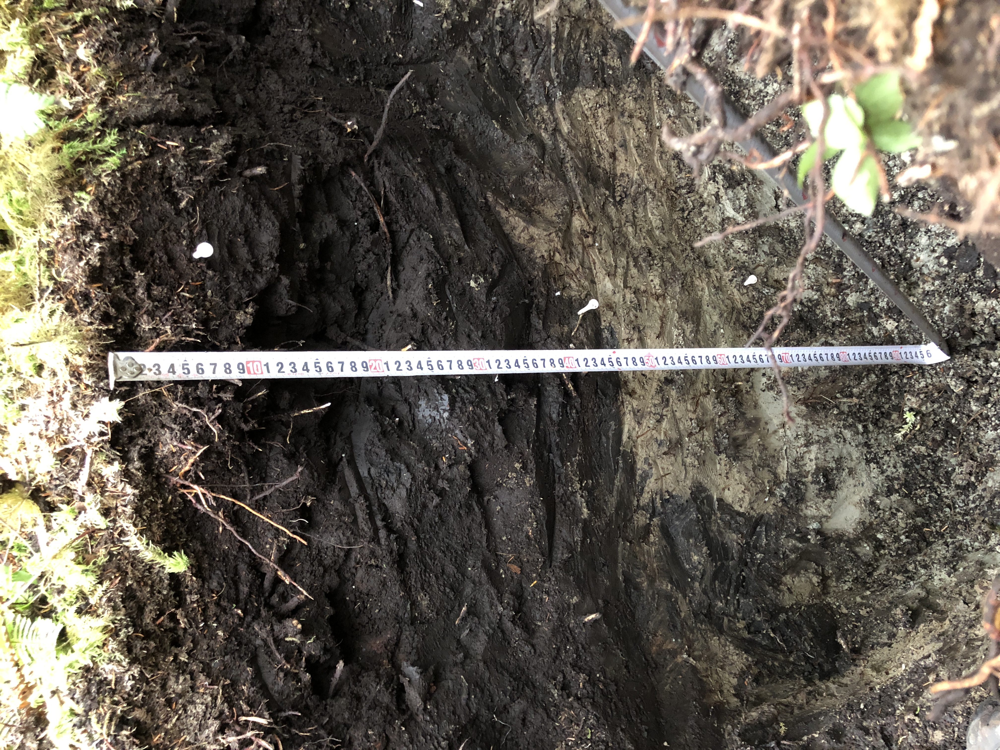
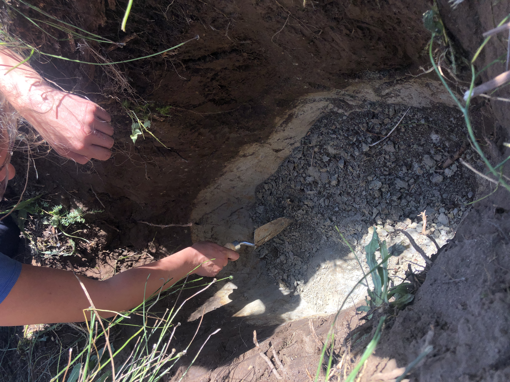
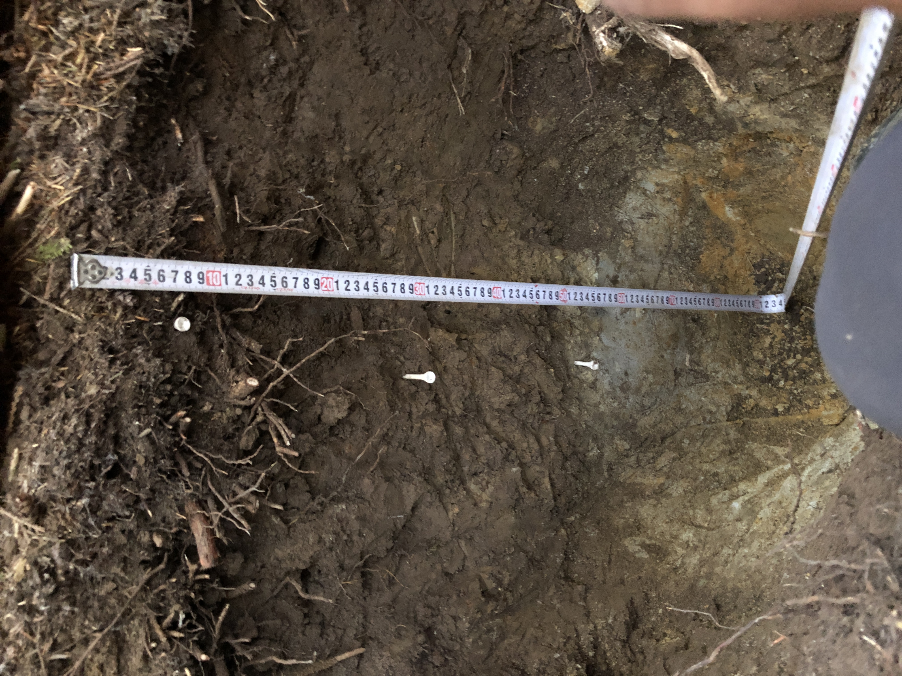
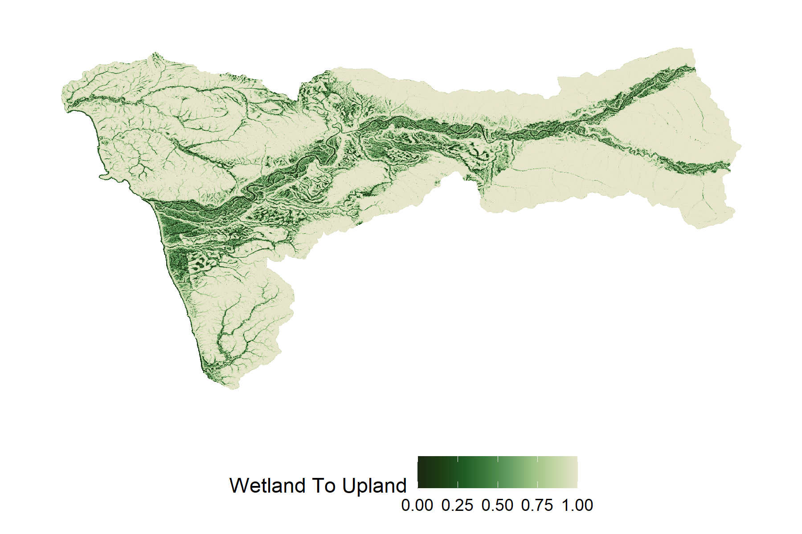
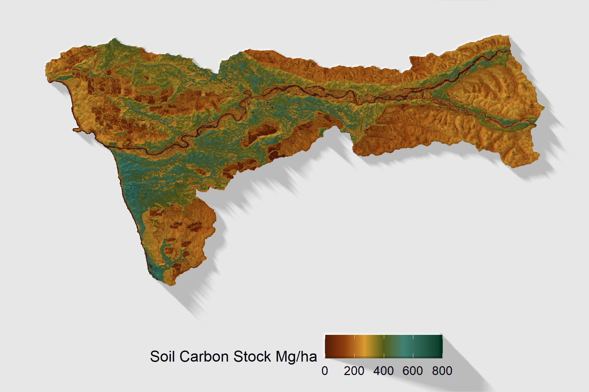

# Washington Teal Carbon
**Teal Carbon**
: Carbon stored in terrestral inland wetlands

Teal carbon differentiates inland wetlands as a significant carbon storing landscape from blue carbon in aquatic/marine environments and green carbon in forests. 
In Washington State and the Pacific Northwest of the U.S. perennial forest cover can hide inland wetlands from convential wetland mapping with aerial photography 
and spectral remote sensing approaches to mapping wetlands. These wetlands can be soil carbon hot spots due to their saturated soils which accumulate organic matter 

I am part of the Teal Carbon research team at the University of Washington which is collaborating with stakeholders to enhance remote sensing approaches to mapping
forested wetlands in order to improve the estimates of soil carbon stocks

# Soil Carbon in Southeast Alaska and the North Pacific Temperate Coastal Rainforest

# Lidar and Terrestrial Laser Scanning
