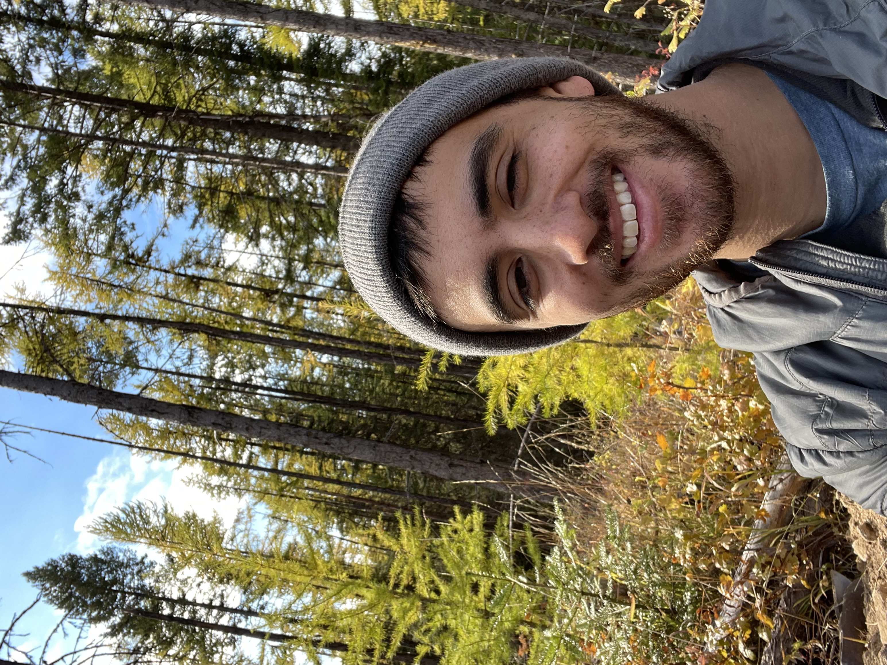

## PhD Student at University of Washington
Using remote sensing to analyze terrestrial ecosystems and their carbon storage. Primarily interested in forested wetlands of the Pacific Northwest 

[Please get in touch with me using my email: ajs0428@uw.edu](mailto:{{ site.email }})

[Or follow me on Twitter @ajstewart04]({{ site.twitter }})

